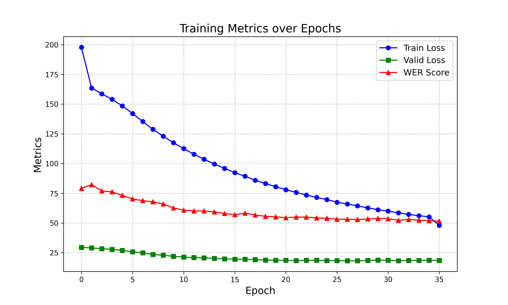

# HTTFC
### Continuous Hand Gesture Translation based on TFNet and CsaNMT

### 基于TFNet和CsaNMT的连续手语翻译

基于CE-CSL数据集，使用mediapipe从原视频提取手部关键点，使用关键点代替图像卷积特征，实现在CPU上的训练和推理。

并将网络输出输入给CsaNMT进行润色。

# 环境配置

Windows10 + WSL2 

（因为ctcdecode需要使用linux环境，故使用WSL2，但是无法发挥硬件性能，正在ubuntu服务器上测试）

Windows10 + WSL2 的环境搭建过程之后会上传

Python 3.9.20

torch==1.11.0+cu113

ctcdecode==1.0.3

mediapipe==0.10.18

opencv-python==4.10.0.84

Flask==3.0.3

# 项目结构

代码分为两部分，一部分在本地训练和推理，另一部分为flask前端推理（APP_前缀）

├─data			  # 存放本地训练和推理用CE-CSL数据集和前端获取的推理用数据集

│  ├─CE-CSL		 # 本地训练和推理用CE-CSL数据集

│  │  ├─images	    # 从CE-CSL视频分割的图像序列

│  │  ├─label	        # CE-CSL数据集标签（原句和分割句子）

│  │  ├─mediapipe      # 从图像序列中提取的手部关键点坐标

│  │  └─video	       # CE-CSL视频

│  └─mydataset	# 前端获取的推理用数据集

│      ├─label		# CE-CSL数据集标签（+前端获取的伪标签）

│      ├─mediapipe	# 前端获取视频中提取的手部关键点坐标

│      └─video		# 前端获取的视频

├─evaluation

├─evaluationT

├─logs			# 训练和推理过程记录

├─mediaPipe_models	# （测试用）手部关键点四分类模型

├─module			# 保存训练模型

├─params			# 环境参数（含本地和前端不同的config.ini）

├─templates		# Flask前端模板

└─testData		# （测试用）本地跑不动TFNet（55h/epoch）所以每个文件夹挑选一个视频进行训练

​    └─CE-CSL

​        ├─images

​        ├─label

​        └─mediapipe

# 快速开始

> [!NOTE]
>
> 本地需要切换模型(从HTTFC切换到TFNet)时，请修改config和dataprocessmoudle
>
> 本地需要切换模型(从HTTFC切换到TFNet)时，请修改config和dataprocessmoudle
>
> 本地需要切换模型(从HTTFC切换到TFNet)时，请修改config和dataprocessmoudle

## 本地训练/推理

#### 基于CE-CSL数据集和TFNet

​	下载CE-CSL数据集，放入data文件夹

​	运行CE-CSLDataPreProcess.py，将视频切分为图像序列，并进行图像归一化

​	在config.ini中配置数据集路径和模型选择

​	**在DataProcessMoudle.py中修改数据处理**

​	在SLR.py中选择训练/推理

​	运行SLR.py

#### 基于CE-CSL手部关键点数据集和HTTFC

​	下载CE-CSL数据集，放入data文件夹

​	运行CE-CSLDataPreProcess.py，将视频切分为图像序列，调用mediapipe检测手部关键点，并进行关键点归一化

​	在config.ini中配置数据集路径和模型选择

​	**在DataProcessMoudle.py中修改数据处理**

​	在SLR.py中选择训练/推理

​	运行SLR.py

ENJOY!

## 从前端获取数据推理

通过*基于CE-CSL手部关键点数据集和HTTFC*训练得到模型后

直接运行APP_flaskapp即可

# 结果

（WSL2&CPU）

训练时间：~55h/epoch👉~55min/epoch

推理耗时：5.802s/per👉0.46s/per

还好mediapipe在CPU上运行很快...

